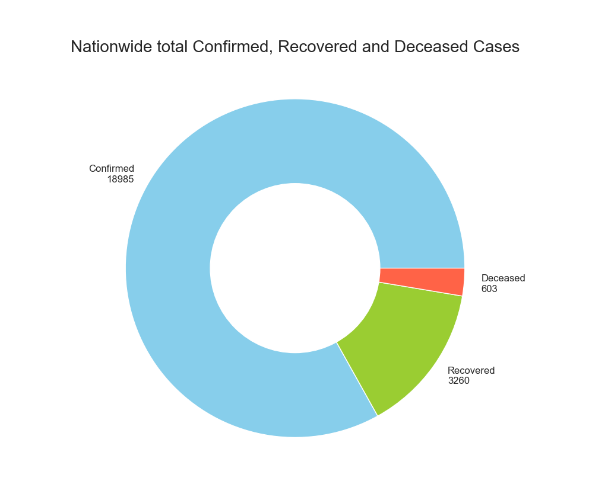
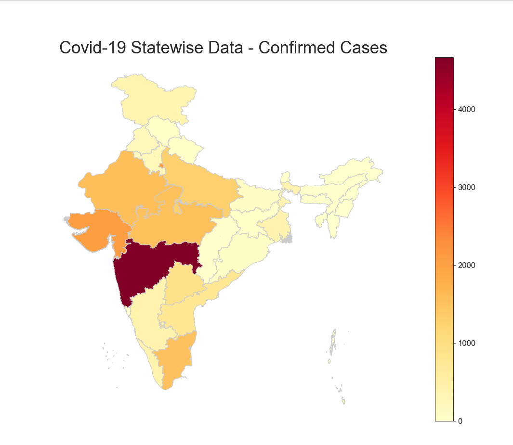

# COVID-19-StatTracker-India
Statewise stats of COVID-19 cases from the official website of MHRD India.

# Packages used
1. Beautifulsoup — A library for pulling data out of html and xml files.
 
2. Requests — A library for making HTTP requests in python.

3. GeoPandas — A library for working with geospatial data in python.

4. PrettyTable — quick and easy to represent tabular data in visually appealing ASCII tables.
and other regular packages like Pandas, Matplotlib and Seaborn.

(Note that Geopandas further depends on fiona for file access and descartes and matplotlib for plotting)

Run *pip install -r requirements.txt* to install the packages in your local machine.

# Statistics as on April 21, 2020

# Graphs and Charts

# Map Distribution

# Web Scraping Basics

Here is a basic idea about web scraping if you want to scale this project to some similar use.

1. Sending an HTTP GET request to the URL of the webpage that you want to scrape, which will respond with the HTML content. We can do this by using the Request library of Python.

2. Analyzing the HTML tags and their attributes, such as class, id, and other HTML tag attributes. Also, identifying your HTML tags where your content lives.

3. Fetching and parsing the data using Beautifulsoup library and maintain the data in some data structure such as Dictionary or List.

4. Output data in any file format such as csv, xlsx, json, etc. or use this tabulated data to make visualizations using Seaborn/Matplotlib libraries.
